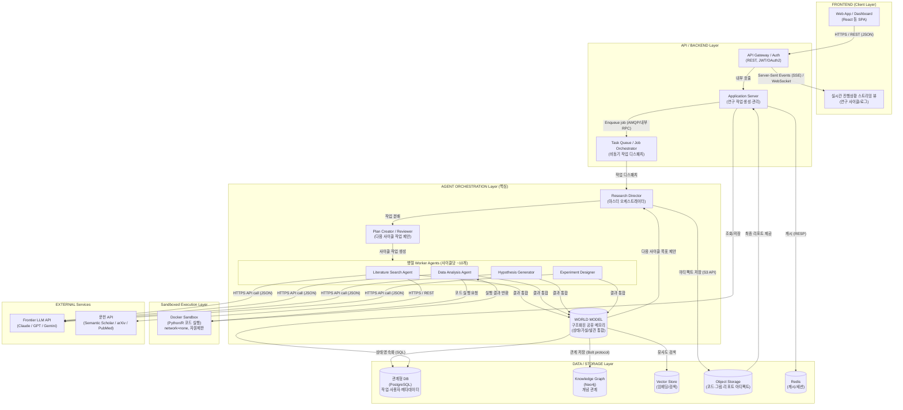
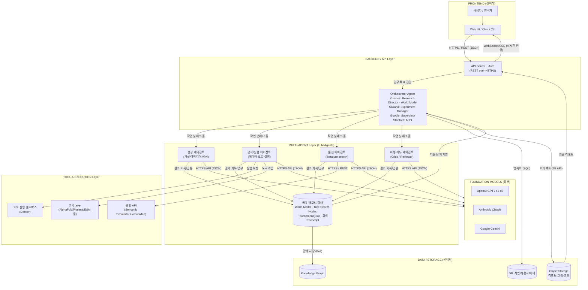

# AI Scientist 시스템 — 예상 전체 소프트웨어 아키텍처 (Mermaid)

조사한 결과(Kosmos 논문 및 오픈소스 구현, Sakana AI Scientist, Google AI Co-Scientist, Stanford Virtual Lab)를 바탕으로 작성한 **예상(추정) 소프트웨어 아키텍처**입니다. 통신 프로토콜을 화살표 라벨에 표기했습니다.

> 참고: 이들은 본질적으로 **LLM 에이전트 시스템**이므로, 전통적인 "프론트엔드-백엔드-DB" 3계층 외에 **에이전트 오케스트레이션 계층**과 **외부 LLM/도구 계층**이 핵심을 이룹니다. 시스템에 따라 프론트엔드나 DB가 없을 수도 있습니다(예: Sakana는 연구용 CLI/배치 위주, DB가 필수 아님).

---

## 1. 대표 사례: Kosmos (Edison Scientific) 상세 아키텍처

가장 완성도 높은 제품형 시스템이므로 프론트엔드·백엔드·DB·샌드박스를 모두 포함합니다.

---

## 2. 일반화 아키텍처 (4개 시스템 공통 패턴)

오케스트레이터의 이름만 다를 뿐(Kosmos: Research Director/World Model, Sakana: Experiment Manager, Google: Supervisor, Stanford: AI PI) 구조는 거의 동일합니다.

---

## 통신 프로토콜 요약

| 구간 | 프로토콜 | 비고 |
| :--- | :--- | :--- |
| 사용자 ↔ 프론트엔드 | HTTPS | 브라우저/CLI |
| 프론트엔드 ↔ 백엔드 API | HTTPS + REST (JSON) | 작업 생성/조회 |
| 백엔드 → 프론트엔드(실시간) | WebSocket / Server-Sent Events(SSE) | 연구 진행상황·로그 스트리밍 |
| 백엔드 ↔ 작업 큐 | AMQP / 내부 RPC | 비동기 장시간 작업(최대 12시간) |
| 에이전트 ↔ 외부 LLM | HTTPS REST (JSON, OpenAI 호환 API) | GPT/Claude/Gemini 호출 |
| 에이전트 ↔ 문헌 API | HTTPS REST | Semantic Scholar/arXiv/PubMed |
| 에이전트 ↔ 코드 샌드박스 | 컨테이너 IPC / 로컬 소켓 | 격리된 Docker, network=none |
| 오케스트레이터 ↔ 관계형 DB | SQL (TCP) | 상태/메타데이터 영속화 |
| 메모리 ↔ Knowledge Graph | Bolt protocol (Neo4j) | 개념 관계 그래프 |
| 백엔드 ↔ Object Storage | S3 API (HTTPS) | 리포트/그림/코드 아티팩트 |
| 백엔드 ↔ 캐시 | RESP (Redis) | 세션/캐시 |

## 시스템별 차이 (선택적 구성요소)

| 구성요소 | Kosmos | Sakana v2 | Google Co-Scientist | Stanford Virtual Lab |
| :--- | :--- | :--- | :--- | :--- |
| 프론트엔드 | 있음(웹 플랫폼) | 거의 없음(연구용 CLI/배치) | 있음(엔터프라이즈) | 거의 없음(연구 코드) |
| 공유 메모리 | World Model | Tree Search 노드 | Tournament/Elo 상태 | 회의 Transcript |
| DB/Graph | PostgreSQL+Neo4j+Vector | 파일/로그 위주 | 내부 인프라 | 파일/로그 위주 |
| 코드 샌드박스 | Docker | Docker(필수 권장) | 내부 | 외부 도구(AlphaFold 등) |
| 기반 LLM | 외부 프론티어(비공개) | Claude/GPT/o1 등 | Gemini(자사) | GPT-4 계열 |

---

## 참고 URL (Reference Sources)

### Edison Scientific / Kosmos
- Kosmos 논문 (arXiv): https://arxiv.org/abs/2511.02824
- Edison Scientific 공식 사이트: https://edisonscientific.com/
- FutureHouse — Announcing Edison Scientific: https://www.futurehouse.org/research-announcements/announcing-edison-scientific
- Alzforum — Introducing Kosmos: https://www.alzforum.org/news/research-news/introducing-kosmos-ai-scientist-makes-discoveries-overnight
- IntuitionLabs — Agentic AI in Pharma R&D (Incyte & Kosmos): https://intuitionlabs.ai/articles/agentic-ai-pharma-rd-incyte-kosmos
- Turing Post — FOD#126: What is Kosmos AI?: https://www.turingpost.com/p/fod126
- Kosmos 오픈소스 구현체 (GitHub): https://github.com/jimmc414/Kosmos
- LinkedIn (Samuel Rodriques, world model 설명): https://www.linkedin.com/posts/samuel-g-rodriques-080a9b22_kosmos-our-newest-ai-scientist-is-available-activity-7391852578470445056-pDS_

### Sakana.ai — The AI Scientist (v1/v2)
- AI Scientist v1 소개: https://sakana.ai/ai-scientist/
- AI Scientist v1 논문 (arXiv): https://arxiv.org/abs/2408.06292
- AI Scientist v2 논문 (arXiv): https://arxiv.org/abs/2504.08066
- AI Scientist v2 (GitHub, 아키텍처·실행 상세): https://github.com/SakanaAI/AI-Scientist-v2
- AI Scientist Nature 게재 소식: https://sakana.ai/ai-scientist-nature/

### Google DeepMind — AI Co-Scientist
- Google Research 블로그: https://research.google/blog/accelerating-scientific-breakthroughs-with-an-ai-co-scientist/
- DeepMind 블로그 (Co-Scientist coalition): https://deepmind.google/blog/co-scientist-a-multi-agent-ai-partner-to-accelerate-research/
- 논문 (arXiv): https://arxiv.org/abs/2502.18864
- Nature 게재: https://www.nature.com/articles/s41586-026-10644-y
- Google Cloud 문서 (Co-Scientist & AlphaEvolve): https://docs.cloud.google.com/gemini/enterprise/docs/co-scientist-and-alphaevolve

### Stanford — The Virtual Lab
- Stanford News: https://news.stanford.edu/stories/2025/07/ai-virtual-scientists-lab-llms
- Stanford Medicine News: https://med.stanford.edu/cancer/about/news/inside-the-virtual-lab--how-ai-scientists-are-accelerating-disco.html
- 논문 (PubMed): https://pubmed.ncbi.nlm.nih.gov/40730228/
- 프리프린트 (bioRxiv): https://www.biorxiv.org/content/10.1101/2024.11.11.623004v1

### 기타 (배경/맥락)
- Nature — Multi-agent AI systems need transparency: https://www.nature.com/articles/s42256-026-01183-2
- arXiv — Autonomous Agents for Scientific Discovery (survey): https://arxiv.org/html/2510.09901v1
- GEN — Google DeepMind and Edison Are Building the AI Scientist: https://www.genengnews.com/topics/artificial-intelligence/google-deepmind-and-edison-are-building-the-ai-scientist/
