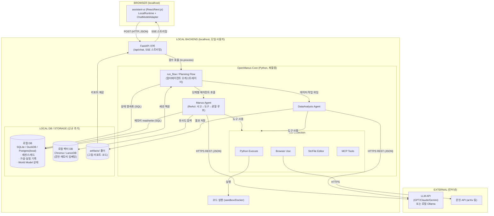

# OpenManus를 개선해 AI Scientist 코어로 쓰면 아키텍처가 바뀔까?

결론부터: **전체 구조(프론트 + 로컬 백엔드 + 외부 API)는 거의 그대로 유지되고, 가운데의 "에이전트 오케스트레이션 계층"을 직접 구현하는 대신 OpenManus로 대체**하는 변화입니다. 즉 골격은 그대로지만 **여러분이 만들 코드량이 크게 줄어듭니다.** 여기에 로컬 DB를 추가하면 OpenManus의 약점(영속성 부재)을 보완하게 됩니다.

## OpenManus가 이미 제공하는 것 (그래서 안 만들어도 되는 것)

OpenManus(MetaGPT 팀, [GitHub](https://github.com/FoundationAgents/OpenManus))는 범용 AI 에이전트 프레임워크로, AI Scientist 코어에 필요한 요소를 상당수 내장하고 있습니다.

| 요소 | OpenManus 제공 내용 | AI Scientist 매핑 |
| :--- | :--- | :--- |
| 멀티에이전트 오케스트레이터 | `run_flow` / Planning Flow (실험적 멀티에이전트) | Orchestrator(Director/Manager) 역할 |
| ReAct 에이전트 루프 | Manus Agent (사고→도구→관찰 반복) | Worker 에이전트 실행 루프 |
| 데이터 분석 에이전트 | `DataAnalysis Agent` (분석·시각화) | Data/Experiment Agent |
| 코드 실행 | Python Execute 도구 + 샌드박스 | 코드 실행 샌드박스 |
| 웹/문헌 수집 | Browser Use, crawl4ai | Literature Agent |
| 도구 확장 | MCP 지원(`run_mcp.py`) | 과학 도구 연동 |
| 멀티모델 | `config.toml`에서 GPT/Claude/Gemini/로컬 모델 지정 | Foundation Model 계층 |

즉, 앞서 그린 일반화 아키텍처의 **"MULTI-AGENT Layer + TOOL Layer"가 OpenManus 하나로 거의 채워집니다.**

## 무엇을 "개선/추가"해야 하나

OpenManus는 범용 에이전트라서 **과학 연구 특화 + 영속성**이 부족합니다. 여기를 보완하는 것이 개선 포인트입니다.

1. **World Model(공유 메모리) 강화**: OpenManus의 메모리는 기본적으로 세션 내 단기 메모리입니다. 가설·실험결과·발견을 구조화해 누적하는 World Model 레이어를 얹어야 합니다 → **로컬 DB가 여기서 핵심 역할**.
2. **연구 사이클 루프**: "가설 생성 → 실험 → 분석 → 다음 가설" 의 반복 루프와 종료조건을 Planning Flow 위에 추가.
3. **Critic/Review 에이전트**: 결과 검증·품질 평가 에이전트 추가.
4. **로컬 DB 연동(추가하려는 부분)**: 세션·스레드·가설·실험 기록·메모리를 영속화.

## 로컬 DB를 추가한 변경 아키텍처 (Mermaid)

## 로컬 DB 선택 가이드

| 용도 | 추천 | 이유 |
| :--- | :--- | :--- |
| 세션·스레드·메타데이터 | **SQLite** | 파일 1개, 무설정, 단일 사용자에 충분 |
| 데이터 분석 대용량 테이블 | **DuckDB** | 컬럼형, 분석 쿼리에 빠름, 로컬 파일 |
| World Model을 SQL로 본격 운영 | 로컬 PostgreSQL | 동시성·관계 필요 시 |
| 문헌/메모리 의미검색 | **Chroma / LanceDB** | 임베딩 기반 검색, 로컬 동작 |
| 그림·리포트·코드 산출물 | 로컬 `artifacts/` 폴더 | DB 불필요, 파일로 충분 |

> 단일 사용자 로컬 기준으로는 **SQLite(상태) + Chroma 또는 LanceDB(벡터) + 로컬 폴더(산출물)** 조합이면 충분합니다. PostgreSQL은 과해질 수 있습니다.

## 아키텍처가 "바뀌는" 정도 요약

| 항목 | OpenManus 도입 전 | OpenManus 도입 후 |
| :--- | :--- | :--- |
| 전체 계층 구조 | 프론트+백엔드+코어+외부API | **동일** (골격 안 바뀜) |
| 오케스트레이터·에이전트 루프 | 직접 구현 | **OpenManus 재활용** (구현량 大폭 감소) |
| 도구(코드실행·브라우저·MCP) | 직접 구현 | **OpenManus 내장 사용** |
| 멀티모델 연결 | 직접 구현 | **config.toml로 설정만** |
| World Model/영속성 | 직접 설계 | **여전히 직접 추가** (+ 로컬 DB) |
| 연구 특화 루프/Critic | 직접 설계 | **여전히 직접 추가** |

## 결론

OpenManus를 개선해 쓰면 **아키텍처의 큰 그림(프론트 assistant-ui + 로컬 FastAPI + 코어 + 외부 API)은 바뀌지 않습니다.** 다만 그동안 "직접 만들어야 했던 오케스트레이션·도구·멀티모델 계층"을 OpenManus가 대신 채워주므로 **개발 부담이 크게 줄어듭니다.** 여러분이 집중할 부분은 (1) 연구 사이클 루프와 Critic 등 **과학 특화 로직**, 그리고 (2) **로컬 DB 기반의 World Model 영속성**입니다. 로컬 DB는 SQLite + 로컬 벡터DB(Chroma/LanceDB) + 파일 폴더 조합이면 단일 사용자 환경에 가장 적합합니다.
