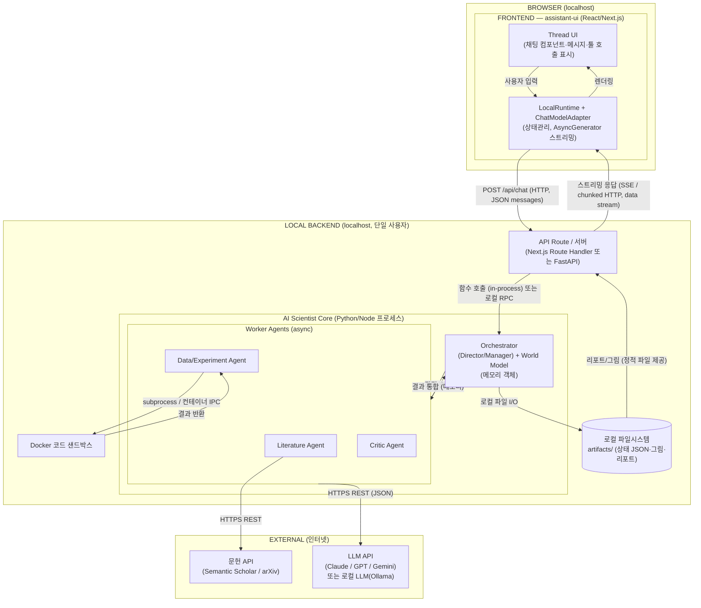

# 로컬 실행 + assistant-ui 프론트엔드 아키텍처

assistant-ui([assistant-ui.com](https://www.assistant-ui.com/))는 React/Next.js 기반의 채팅 프론트엔드 라이브러리입니다. 로컬 단일 사용자 AI Scientist에 프론트를 얹는 용도로 적합하며, 핵심은 **`LocalRuntime` + `ChatModelAdapter`** 구조입니다.

## 핵심 동작 방식

- `LocalRuntime`이 **메시지·스레드·대화 이력 상태를 브라우저 안에서 자체 관리**합니다(별도 상태 서버 불필요).
- 백엔드 연결은 `ChatModelAdapter`의 `run()` 함수 한 곳만 구현하면 됩니다. 여기서 **여러분의 로컬 백엔드 엔드포인트(`POST /api/chat` 등)로 fetch** 합니다.
- **스트리밍**은 `run`을 `AsyncGenerator`로 선언하고 `yield` 하면 됩니다 → 연구 진행 로그를 실시간으로 채팅창에 흘릴 수 있습니다.
- **Tool Calling**(OpenAI 호환 함수 호출)과 **human-in-the-loop 승인**을 지원합니다 → "이 실험 코드를 실행할까요?" 같은 확인 단계를 UI에서 처리 가능.
- 스레드 영속화가 필요하면 `history adapter`(단일 스레드) 또는 커스텀 DB 어댑터를 쓸 수 있지만, **로컬 단일 사용자라면 인메모리 또는 로컬 JSON으로 충분**합니다(Assistant Cloud는 선택사항이며 안 써도 됨).

## 아키텍처 (Mermaid)

## 통신 프로토콜 요약

| 구간 | 프로토콜 | 비고 |
| :--- | :--- | :--- |
| Thread UI ↔ LocalRuntime | 브라우저 내부(in-memory) | 상태관리, 별도 통신 없음 |
| LocalRuntime → 백엔드 | HTTP POST (JSON messages) | `ChatModelAdapter.run()`에서 fetch |
| 백엔드 → LocalRuntime(스트리밍) | SSE 또는 chunked HTTP(data stream) | `AsyncGenerator`로 실시간 토큰/진행상황 |
| 백엔드 ↔ AI Scientist Core | in-process 함수 호출(같은 언어면) 또는 로컬 HTTP/RPC(언어 분리 시) | Next.js면 동일 프로세스, Python 코어면 FastAPI 분리 |
| Core ↔ 코드 샌드박스 | subprocess / Docker IPC | 격리 실행 |
| 에이전트 ↔ LLM | HTTPS REST(JSON) | 외부 또는 로컬(Ollama) |
| 에이전트 ↔ 문헌 API | HTTPS REST | Semantic Scholar/arXiv |
| Core ↔ 저장 | 로컬 파일 I/O | `artifacts/` 폴더 |

## 권장 구성 (현실적인 두 가지 조합)

가장 깔끔한 두 가지 패턴입니다.

1. **올인원 Next.js (코어도 JS/TS인 경우)**: assistant-ui + Next.js Route Handler 한 프로젝트. `run()`이 같은 서버의 API Route를 호출하고, 그 안에서 에이전트 로직 실행. 추가 서버·포트 없이 가장 단순.

2. **프론트 + Python 백엔드 분리 (코어가 Python인 경우, AI Scientist는 보통 Python)**: assistant-ui(Next.js)는 UI만 담당하고, `run()`이 **로컬 FastAPI 서버(`localhost:8000`)** 로 스트리밍 요청. AI Scientist 코어(Kosmos/Sakana류 Python)는 FastAPI 안에서 구동. 이 경우 프론트↔백엔드는 localhost HTTP(SSE) 통신.

> AI Scientist 코어들이 대부분 Python이라는 점을 감안하면 **2번(assistant-ui + 로컬 FastAPI, SSE 스트리밍)** 조합이 가장 자연스럽습니다.

## 정리

assistant-ui를 쓰면 프론트엔드 쪽은 **상태관리·스트리밍·툴 호출 UI·이력 관리가 이미 내장**되어 있어, 여러분이 직접 만들 부분은 사실상 **백엔드 엔드포인트 하나(`/api/chat`)와 `ChatModelAdapter.run()`의 fetch 연결**뿐입니다. 멀티유저 클라우드 인프라(인증서버·작업큐·멀티테넌시 DB·Redis 등)는 여전히 불필요하며, 프론트가 생겼어도 백엔드는 **localhost의 단일 프로세스 + 로컬 폴더 + 외부 API 호출** 수준으로 유지됩니다.
